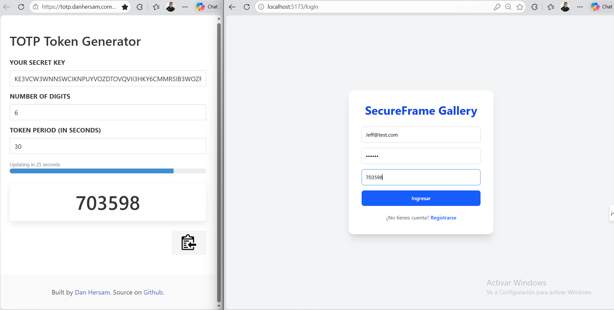
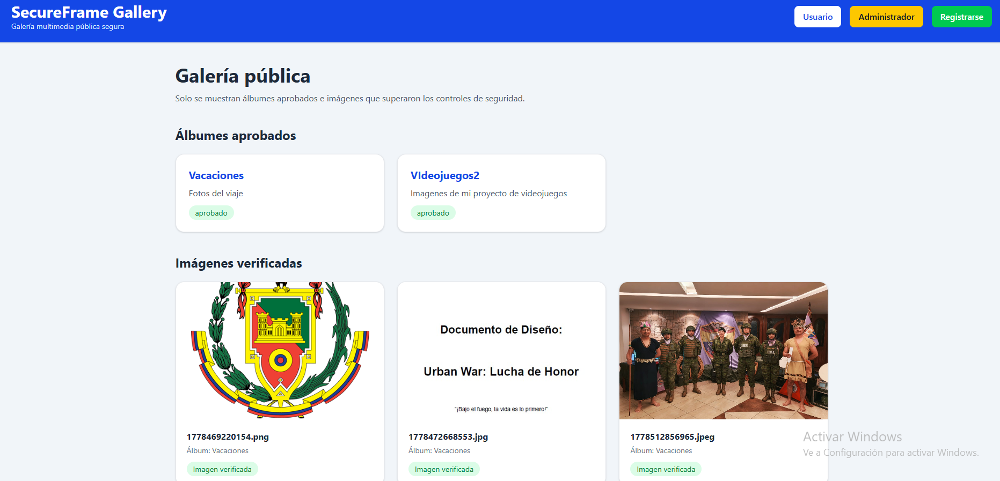
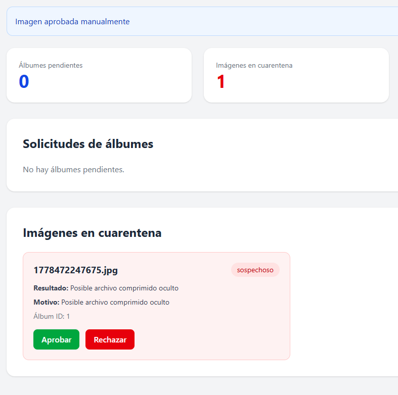
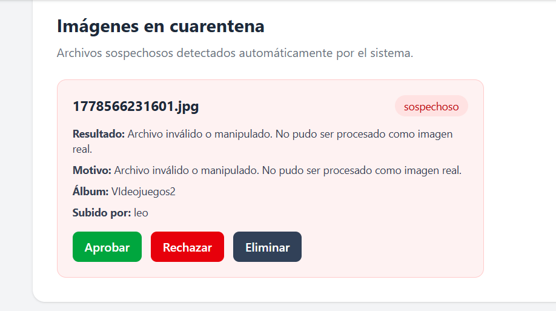
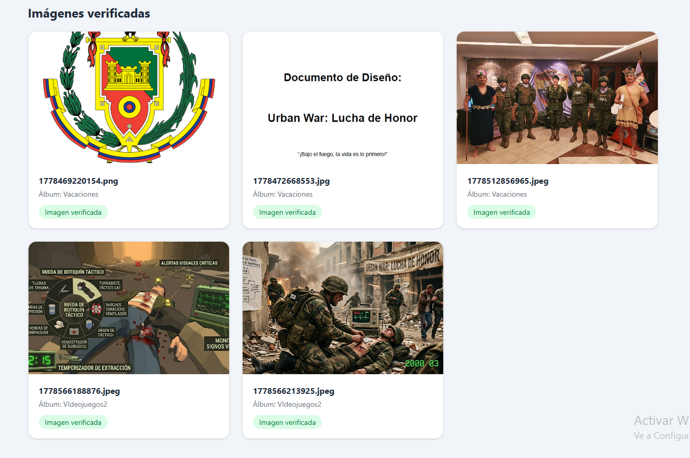

<div align="center">

<!-- BANNER -->


<br/>

<!-- BADGES -->


<br/>
<br/>

> **🛡️ Aplicación web full stack desarrollada bajo principios de Desarrollo Seguro de Software (SSDLC), enfocada en la gestión de galerías multimedia públicas con mecanismos avanzados de autenticación, control de acceso y detección de esteganografía.**

<br/>

[🚀 Demo](#-demo) •
[📦 Instalación](#-instalación) •
[🏗️ Arquitectura](#️-arquitectura-del-sistema) •
[🔐 Seguridad](#-controles-de-seguridad) •
[📡 API](#-endpoints-de-la-api) •
[🧪 Pruebas](#-pruebas-realizadas) •
[👥 Autores](#-autores)

</div>

---

## 📋 Tabla de Contenidos

- [📖 Descripción General](#-descripción-general)
- [✨ Características Principales](#-características-principales)
- [🏗️ Arquitectura del Sistema](#️-arquitectura-del-sistema)
- [🗂️ Estructura del Proyecto](#️-estructura-del-proyecto)
- [⚙️ Stack Tecnológico](#️-stack-tecnológico)
- [🔐 Controles de Seguridad](#-controles-de-seguridad)
- [🔄 Flujo General del Sistema](#-flujo-general-del-sistema)
- [📦 Instalación](#-instalación)
- [🗃️ Configuración de Base de Datos](#️-configuración-de-base-de-datos)
- [📡 Endpoints de la API](#-endpoints-de-la-api)
- [🧬 Detección de Esteganografía](#-detección-de-esteganografía)
- [🧪 Pruebas Realizadas](#-pruebas-realizadas)
- [📸 Evidencias del Sistema](#-evidencias-del-sistema)
- [🛡️ Principios SSDLC Aplicados](#️-principios-ssdlc-aplicados)
- [📚 Estándares y Referencias](#-estándares-y-referencias)
- [👥 Autores](#-autores)

---

## 📖 Descripción General

**SecureFrame Gallery** es una plataforma de galería multimedia diseñada desde cero con una mentalidad **Security-First**. Cada componente del sistema —desde el registro de usuarios hasta la publicación de imágenes— ha sido construido aplicando controles de seguridad en múltiples capas (defensa en profundidad).

El proyecto nace como respuesta a las vulnerabilidades más comunes en aplicaciones web de gestión multimedia, abordando problemas reales documentados en el **OWASP Top 10**, el **NIST SP 800-218** y las guías del **ASVS**.

```
┌─────────────────────────────────────────────────────────────────┐
│                     SECUREFRAME GALLERY                         │
│                                                                 │
│  Visitante  ──►  Galería Pública  (solo contenido aprobado)     │
│  Usuario    ──►  Upload + 2FA  ──►  Validación automática       │
│  Admin      ──►  Revisión de cuarentena + Gestión de roles      │
└─────────────────────────────────────────────────────────────────┘
```

---

## ✨ Características Principales

### 🔑 Seguridad de Autenticación

| Característica | Detalle |
|---|---|
| 🔒 Registro seguro | Validación de entradas y unicidad de correo |
| 🔑 Hashing de contraseñas | bcrypt con salt rounds configurables |
| 🪙 Sesiones JWT | Tokens firmados y con expiración definida |
| 📲 Doble Factor (2FA) | Códigos TOTP mediante Speakeasy (RFC 6238) |
| 🚫 Rate Limiting | Protección contra fuerza bruta en login |

### 🛂 Seguridad de Acceso

| Característica | Detalle |
|---|---|
| 👥 RBAC | Control de acceso basado en roles (Usuario / Administrador) |
| 🔐 Rutas protegidas | Middleware de verificación JWT en endpoints privados |
| 🧱 Mínimo privilegio | Usuarios solo acceden a sus propios recursos |

### 🖼️ Seguridad Multimedia

| Característica | Detalle |
|---|---|
| 📂 Validación MIME real | Verificación de firma hexadecimal del archivo |
| 🧹 Eliminación EXIF | Eliminación de metadatos con Sharp |
| 🔄 Reescritura segura | Re-renderizado de imagen para neutralizar payloads |
| 🔍 Detección ZIP → JPG | Análisis de firma `504b0304` en archivos renombrados |
| 🚨 Cuarentena automática | Archivos sospechosos aislados hasta revisión manual |

### 🌐 Seguridad Web

| Característica | Detalle |
|---|---|
| ⛑️ Helmet | Headers de seguridad HTTP configurados |
| 📜 CSP | Content Security Policy estricta |
| 🛡️ Anti-XSS | Sanitización y validación de entradas |
| 🖼️ Anti-Clickjacking | Header `X-Frame-Options` activado |
| 🔗 Restricción de recursos | Bloqueo de fuentes externas no autorizadas |

---

## 🏗️ Arquitectura del Sistema

### Diagrama de Alto Nivel

```
┌──────────────────────────────────────────────────────────────────────────┐
│                         SECUREFRAME GALLERY                              │
│                                                                          │
│   ┌─────────────┐     HTTPS      ┌──────────────────────────────────┐   │
│   │             │ ─────────────► │          FRONTEND                │   │
│   │   Browser   │                │  React + Vite + Tailwind CSS     │   │
│   │  (Usuario / │ ◄───────────── │  Axios · React Router DOM        │   │
│   │   Admin /   │                └────────────────┬─────────────────┘   │
│   │  Visitante) │                                 │ REST API             │
│   └─────────────┘                ┌────────────────▼─────────────────┐   │
│                                  │           BACKEND                │   │
│                                  │  Node.js + Express.js            │   │
│                                  │                                  │   │
│                                  │  ┌──────────┐  ┌─────────────┐  │   │
│                                  │  │  Auth     │  │  Multimedia │  │   │
│                                  │  │  JWT+2FA  │  │  Pipeline   │  │   │
│                                  │  └──────────┘  └──────┬──────┘  │   │
│                                  │                        │         │   │
│                                  │  ┌─────────────────────▼──────┐ │   │
│                                  │  │  Security Middleware Layer  │ │   │
│                                  │  │  Helmet · Rate Limit · CSP  │ │   │
│                                  │  └────────────────────────────┘ │   │
│                                  └───────────┬──────────────────────┘   │
│                                              │                           │
│                        ┌─────────────────────▼──────────────────┐       │
│                        │             MySQL Database             │       │
│                        │  usuarios · albumes · imagenes ·       │       │
│                        │  cuarentena                            │       │
│                        └────────────────────────────────────────┘       │
└──────────────────────────────────────────────────────────────────────────┘
```

### Diagrama de Capas de Seguridad (Defensa en Profundidad)

```
                    ╔═══════════════════════════════╗
                    ║        CAPA 1: NETWORK        ║
                    ║    HTTPS · CSP · CORS · Helmet ║
                    ╚══════════════╦════════════════╝
                                   ║
                    ╔══════════════▼════════════════╗
                    ║      CAPA 2: AUTENTICACIÓN    ║
                    ║    JWT · bcrypt · 2FA TOTP    ║
                    ╚══════════════╦════════════════╝
                                   ║
                    ╔══════════════▼════════════════╗
                    ║      CAPA 3: AUTORIZACIÓN     ║
                    ║        RBAC · Middleware      ║
                    ╚══════════════╦════════════════╝
                                   ║
                    ╔══════════════▼════════════════╗
                    ║    CAPA 4: VALIDACIÓN INPUT   ║
                    ║  Sanitización · MIME · EXIF   ║
                    ╚══════════════╦════════════════╝
                                   ║
                    ╔══════════════▼════════════════╗
                    ║    CAPA 5: DATOS EN REPOSO    ║
                    ║   Hashes · Cuarentena · DB    ║
                    ╚═══════════════════════════════╝
```

### Pipeline de Procesamiento Multimedia

```
  Archivo subido por usuario
         │
         ▼
  ┌─────────────────┐
  │ Validación MIME │  ◄─── ¿El magic byte corresponde a una imagen?
  └────────┬────────┘
           │ ✅ OK              ❌ RECHAZADO ──► Error 400
           ▼
  ┌─────────────────┐
  │ Análisis Hex    │  ◄─── ¿Contiene firma ZIP (504b0304)?
  └────────┬────────┘
           │ Limpio             ⚠️ SOSPECHOSO ──► CUARENTENA
           ▼
  ┌─────────────────┐
  │ Sanitización    │  ◄─── Sharp re-renderiza la imagen
  │ con Sharp       │       y elimina metadatos EXIF
  └────────┬────────┘
           │
           ▼
  ┌─────────────────┐
  │ Almacenamiento  │  ◄─── Archivo limpio guardado
  │ seguro          │
  └────────┬────────┘
           │
           ▼
  Pendiente de aprobación de administrador
           │
           ▼
  ┌──────────────────────────────────────────┐
  │ Admin aprueba ──► Publicada en galería   │
  │ Admin rechaza ──► Eliminada              │
  └──────────────────────────────────────────┘
```

---

## 🗂️ Estructura del Proyecto

```
secureframe-gallery/
│
├── 📁 backend/
│   ├── 📁 src/
│   │   ├── 📁 config/          # Conexión a base de datos
│   │   ├── 📁 controllers/     # Lógica de negocio (auth, album, image)
│   │   ├── 📁 middlewares/     # JWT verify, RBAC, rate limiting
│   │   ├── 📁 routes/          # Definición de endpoints REST
│   │   ├── 📁 services/        # Lógica de detección, sanitización
│   │   ├── 📁 uploads/         # Archivos en cuarentena y aprobados
│   │   └── 📄 app.js           # Entry point + Helmet + Express
│   │
│   ├── 📄 package.json
│   └── 📄 .env                 # Variables de entorno (NO subir al repo)
│
├── 📁 frontend/
│   ├── 📁 src/
│   │   ├── 📁 pages/           # Login, Register, Dashboard, Admin, Gallery
│   │   ├── 📁 services/        # Axios API calls
│   │   ├── 📁 styles/          # Tailwind CSS
│   │   ├── 📄 App.jsx          # Rutas y providers
│   │   └── 📄 main.jsx         # Entry point React
│   │
│   ├── 📄 package.json
│   └── 📄 vite.config.js
│
├── 📁 screenshots/             # Evidencias visuales del sistema
├── 📄 README.md
└── 📄 .gitignore
```

---

## ⚙️ Stack Tecnológico

### Backend

<div align="center">

| Tecnología | Versión | Uso |
|---|---|---|
|  | 20.x | Runtime del servidor |
|  | 4.x | Framework HTTP |
|  | 8.x | Base de datos relacional |
|  | — | Autenticación stateless |
|  | — | Hashing de contraseñas |
|  | — | Gestión de subida de archivos |
|  | — | Sanitización y procesamiento de imágenes |
|  | — | Generación de códigos TOTP (2FA) |
|  | — | Headers de seguridad HTTP |
|  | — | Protección contra fuerza bruta |

</div>

### Frontend

<div align="center">

| Tecnología | Versión | Uso |
|---|---|---|
|  | 18.x | UI framework |
|  | 5.x | Build tool + dev server |
|  | 3.x | Estilos utilitarios |
|  | — | Cliente HTTP |
|  | 6.x | Enrutamiento SPA |

</div>

---

## 🔐 Controles de Seguridad

| # | Control | Implementación | Estándar Ref. |
|---|---|---|---|
| 01 | Hashing de contraseñas | `bcrypt` con salt | NIST SP 800-63B |
| 02 | Autenticación stateless | JWT firmado + expiración | OWASP ASVS V3 |
| 03 | Doble factor (2FA) | TOTP via `speakeasy` (RFC 6238) | NIST SP 800-63B |
| 04 | Protección fuerza bruta | `express-rate-limit` | OWASP A07:2021 |
| 05 | Headers de seguridad | `helmet` | OWASP ASVS V14 |
| 06 | Content Security Policy | CSP estricta vía helmet | OWASP A05:2021 |
| 07 | Control de acceso por roles | RBAC con middleware | OWASP A01:2021 |
| 08 | Validación MIME real | `file-type` magic bytes | OWASP A03:2021 |
| 09 | Sanitización de imágenes | Sharp reescritura + EXIF strip | NIST SP 800-218 |
| 10 | Detección payload ZIP | Análisis hexadecimal `504b0304` | Análisis forense |
| 11 | Cuarentena automática | MySQL + flujo de revisión admin | Zero Trust |
| 12 | Anti-XSS | Validación y sanitización de entradas | OWASP A03:2021 |
| 13 | Anti-Clickjacking | `X-Frame-Options: DENY` | OWASP A05:2021 |

---

## 🔄 Flujo General del Sistema

### Flujo de Usuario

```
  [1] Registro  ──►  [2] Login  ──►  [3] Verificación 2FA (TOTP)
                                              │
                                              ▼
                              [4] Solicitud de creación de álbum
                                              │
                                              ▼
                              [5] Subida de imágenes al álbum
                                              │
                                              ▼
                              [6] Validación automática de seguridad
                                     (MIME · Hex · Sharp · EXIF)
                                              │
                              ┌───────────────┴───────────────┐
                              ▼                               ▼
                        ✅ Imagen limpia               ⚠️ Sospechosa
                      Pendiente de admin             → CUARENTENA
```

### Flujo de Administrador

```
  [1] Login con 2FA
         │
         ▼
  [2] Panel Admin
         │
         ├──► Revisar álbumes pendientes  →  Aprobar / Rechazar
         │
         ├──► Revisar imágenes en cuarentena  →  Aprobar / Rechazar
         │
         └──► Gestión de contenido publicado
```

### Flujo de Visitante

```
  [Navegador]  ──►  GET /api/album/publicos
                          │
                          ▼
              Solo álbumes e imágenes aprobadas
              (sin autenticación requerida)
```

---

## 📦 Instalación

### Requisitos Previos

- **Node.js** >= 18.x
- **MySQL** >= 8.x
- **npm** >= 9.x
- **Git**

> ⚠️ Nunca subas el archivo `.env` al repositorio. Está incluido en `.gitignore`.

---

### 🔧 Backend

```bash
# 1. Clonar el repositorio
git clone https://github.com/tu-usuario/secureframe-gallery.git
cd secureframe-gallery/backend

# 2. Instalar dependencias
npm install

# 3. Crear archivo de entorno
cp .env.example .env
```

Editar `.env`:

```env
PORT=3000
DB_HOST=localhost
DB_USER=root
DB_PASSWORD=TU_PASSWORD
DB_NAME=secureframe_gallery
JWT_SECRET=clave_segura_proyecto_2026
```

```bash
# 4. Iniciar servidor de desarrollo
npm run dev
```

Servidor disponible en:

```
http://localhost:3000
```

---

### 🎨 Frontend

```bash
# 1. Entrar al frontend
cd ../frontend

# 2. Instalar dependencias
npm install

# 3. Iniciar servidor de desarrollo
npm run dev
```

Frontend disponible en:

```
http://localhost:5173
```

---

## 🗃️ Configuración de Base de Datos

```sql
-- 1. Crear la base de datos
CREATE DATABASE secureframe_gallery;
USE secureframe_gallery;

-- 2. Tablas requeridas
-- usuarios    → Datos de usuarios, hashes, 2FA secrets
-- albumes     → Álbumes con estado (pendiente / aprobado / rechazado)
-- imagenes    → Imágenes procesadas vinculadas a álbumes
-- cuarentena  → Registro de archivos sospechosos pendientes de revisión
```

### Diagrama Entidad-Relación (simplificado)

```
┌──────────────┐       ┌──────────────┐       ┌──────────────┐
│   usuarios   │       │   albumes    │       │   imagenes   │
│──────────────│       │──────────────│       │──────────────│
│ id           │──┐    │ id           │──┐    │ id           │
│ nombre       │  └───►│ usuario_id   │  └───►│ album_id     │
│ correo       │       │ nombre       │       │ path_archivo │
│ password     │       │ descripcion  │       │ estado       │
│ rol          │       │ estado       │       │ fecha        │
│ secret_2fa   │       │ fecha        │       └──────────────┘
│ 2fa_activo   │       └──────────────┘
└──────────────┘
                                              ┌──────────────┐
                                              │  cuarentena  │
                                              │──────────────│
                                              │ id           │
                                              │ imagen_id    │
                                              │ razon        │
                                              │ estado       │
                                              │ fecha        │
                                              └──────────────┘
```

---

## 📡 Endpoints de la API

**Base URL:** `http://localhost:3000/api`

### 🔐 Autenticación

| Método | Endpoint | Descripción | Auth |
|---|---|---|---|
| `POST` | `/auth/registro` | Registro de nuevo usuario | ❌ |
| `POST` | `/auth/login` | Login y obtención de JWT | ❌ |

### 📲 Doble Factor (2FA)

| Método | Endpoint | Descripción | Auth |
|---|---|---|---|
| `GET` | `/2fa/generar` | Genera secret TOTP + QR | ✅ JWT |
| `POST` | `/2fa/activar` | Activa 2FA con código TOTP | ✅ JWT |

### 📁 Álbumes

| Método | Endpoint | Descripción | Auth |
|---|---|---|---|
| `POST` | `/album/crear` | Crea un nuevo álbum | ✅ JWT |
| `GET` | `/album/pendientes` | Lista álbumes en revisión | ✅ Admin |
| `PUT` | `/album/aprobar/:id` | Aprueba un álbum | ✅ Admin |
| `GET` | `/album/publicos` | Lista álbumes públicos | ❌ |

### 🖼️ Imágenes

| Método | Endpoint | Descripción | Auth |
|---|---|---|---|
| `POST` | `/image/subir` | Sube una imagen (con análisis) | ✅ JWT |
| `GET` | `/image/cuarentena` | Lista imágenes en cuarentena | ✅ Admin |
| `PUT` | `/image/aprobar/:id` | Aprueba imagen de cuarentena | ✅ Admin |
| `PUT` | `/image/rechazar/:id` | Rechaza imagen de cuarentena | ✅ Admin |
| `GET` | `/image/publicas` | Lista imágenes aprobadas | ❌ |

---

## 🧬 Detección de Esteganografía

El sistema implementa un análisis forense preventivo multicapa para detectar imágenes manipuladas o con payloads ocultos.

### ¿Qué se detecta?

```
Técnica de ataque        →   Método de detección
─────────────────────────────────────────────────────────────────
ZIP renombrado a .jpg    →   Firma hex 504b0304 (PK magic bytes)
Archivo exe como imagen  →   Validación MIME real (file-type)
Metadatos maliciosos     →   Eliminación completa de EXIF (Sharp)
Payload embebido         →   Re-renderizado limpio de píxeles
```

### Pipeline de análisis

```javascript
// Paso 1: Validación MIME real
const type = await fileTypeFromBuffer(buffer);
if (!['image/jpeg', 'image/png', 'image/webp'].includes(type?.mime)) {
  return res.status(400).json({ error: 'Tipo de archivo no permitido' });
}

// Paso 2: Análisis hexadecimal — detección de firma ZIP
const hexHeader = buffer.slice(0, 4).toString('hex');
if (hexHeader === '504b0304') {
  // Archivo en cuarentena automática
  await quarantine(file, 'Posible archivo comprimido oculto');
}

// Paso 3: Sanitización con Sharp — reescritura + strip EXIF
await sharp(buffer)
  .withMetadata(false)   // elimina EXIF
  .toFile(outputPath);   // re-renderiza píxeles desde cero
```

> 💡 **Resultado:** Aunque el sistema no detecta todos los métodos de esteganografía avanzada (ej. LSB encoding), cubre los vectores más comunes usados por atacantes para evadir controles superficiales basados solo en extensión de archivo.

---

## 🧪 Pruebas Realizadas

### ✅ Prueba 1 — Archivo ZIP renombrado como JPG

| Campo | Detalle |
|---|---|
| Archivo de prueba | `payload.zip` renombrado a `imagen_normal.jpg` |
| Firma hex detectada | `504b0304` (magic bytes de ZIP) |
| Resultado esperado | Cuarentena automática |
| Resultado obtenido | ✅ `Posible archivo comprimido oculto` — enviado a cuarentena |
| Acción del admin | Revisión manual → Rechazo |

### ✅ Prueba 2 — Imagen válida con metadatos EXIF

| Campo | Detalle |
|---|---|
| Archivo de prueba | Foto con coordenadas GPS y datos de cámara en EXIF |
| Resultado esperado | EXIF eliminado antes de almacenar |
| Resultado obtenido | ✅ Metadatos eliminados con Sharp |

### ✅ Prueba 3 — Fuerza bruta en login

| Campo | Detalle |
|---|---|
| Escenario | 10 intentos de login fallidos en < 15 minutos |
| Resultado esperado | Bloqueo temporal |
| Resultado obtenido | ✅ `429 Too Many Requests` |

### ✅ Prueba 4 — Acceso sin JWT a ruta protegida

| Campo | Detalle |
|---|---|
| Escenario | `GET /api/album/pendientes` sin token |
| Resultado esperado | Error de autorización |
| Resultado obtenido | ✅ `401 Unauthorized` |

---

## 📸 Evidencias del Sistema

<div align="center">

| Pantalla | Vista previa |
|---|---|
| 🔐 **Login Seguro** |  |
| 📝 **Registro Seguro** |  |
| 🏠 **Dashboard del Usuario** |  |
| 🛠️ **Panel Administrador** |  |
| ⚠️ **Detección y Cuarentena** |  |
| 🖼️ **Galería Pública** |  |

</div>

---

## 🛡️ Principios SSDLC Aplicados

```
 ╔══════════════════════════════════════════════════════════════╗
 ║             SECURE SOFTWARE DEVELOPMENT LIFECYCLE            ║
 ╠══════════════════════════════════════════════════════════════╣
 ║  🔍 Seguridad desde el diseño     Security by Design        ║
 ║  ✅ Validación de entradas        Input Validation           ║
 ║  🔒 Mínimo privilegio             Principle of Least Priv.  ║
 ║  🧱 Defensa en profundidad        Defense in Depth           ║
 ║  🖼️ Hardening multimedia          Media Security             ║
 ║  🔑 Autenticación robusta         Strong Authentication      ║
 ║  📁 Gestión segura de contenido   Secure Content Management  ║
 ╚══════════════════════════════════════════════════════════════╝
```

---

## 📚 Estándares y Referencias

| Estándar | Descripción | Aplicación en el proyecto |
|---|---|---|
| [OWASP Top 10](https://owasp.org/www-project-top-ten/) | Los 10 riesgos más críticos en aplicaciones web | A01 (RBAC), A03 (XSS/MIME), A05 (CSP), A07 (Rate Limit) |
| [OWASP ASVS](https://owasp.org/www-project-application-security-verification-standard/) | Estándar de verificación de seguridad de aplicaciones | V3 (Auth), V12 (Files), V14 (HTTP) |
| [NIST SP 800-218](https://csrc.nist.gov/publications/detail/sp/800-218/final) | Secure Software Development Framework | Ciclo SSDLC completo |
| [NIST SP 800-63B](https://pages.nist.gov/800-63-3/sp800-63b.html) | Digital Identity Guidelines | bcrypt, TOTP, 2FA |
| [RFC 6238](https://datatracker.ietf.org/doc/html/rfc6238) | TOTP: Time-Based One-Time Password Algorithm | Speakeasy 2FA |
| Zero Trust | Verificar siempre, nunca confiar implícitamente | JWT verification en cada request |

---

## 🔑 Credenciales de Prueba

> ⚠️ Solo para entornos de desarrollo. Las contraseñas no se almacenan en texto plano; el sistema utiliza **bcrypt** para guardar únicamente el hash seguro.

### Administrador

```
Correo:      jeff@test.com
Contraseña:  123456
2FA:         Código TOTP generado via Speakeasy
```

### Usuario Normal

```
Correo:      usuario@test.com
Contraseña:  123456
2FA:         Opcional (puede activarse desde el dashboard)
```

---

## 👥 Autores

<div align="center">

| | Nombre | Rol |
|---|---|---|
| 👨‍💻 | **Jefferson Masapanta** | Desarrollo Backend · Seguridad · DB |
| 👨‍💻 | **Wilmer Buestan** | Desarrollo Frontend · Integración · Docs |

**Carrera de Ingeniería de Software**
**Universidad de las Fuerzas Armadas ESPE · 2026**

</div>

---

<div align="center">


**SecureFrame Gallery** — Desarrollado con 🛡️ y principios SSDLC

*Universidad de las Fuerzas Armadas ESPE · Ingeniería de Software · 2026*

</div>
